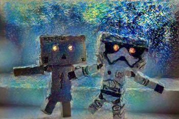
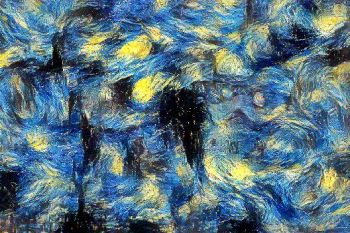
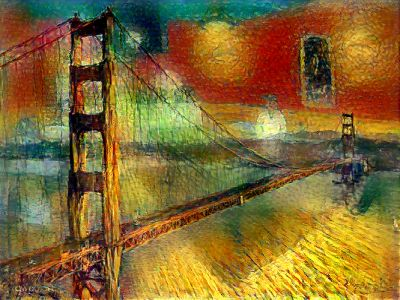
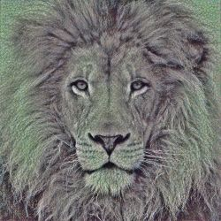
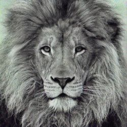
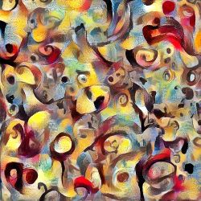

# Citation

If you find this code useful for your research, please cite the following:
```shell
@misc{
  author = {PeinuanQin, YitianYang},
  title = {pytorch-img-style-transfer},
  year = {2022},
  publisher = {GitHub},
  journal = {GitHub repository},
  howpublished = {\url{https://github.com/gordicaleksa/pytorch-neural-style-transfer}},
}
```

- our code is reproduced based on the work of https://github.com/gordicaleksa/pytorch-neural-style-transfer
- but we make it more clear, annotated and more object-oriented


## Neural Style Transfer (optimization method) :computer: + :art: = :heart:
This repo contains a concise PyTorch implementation of the original NST paper (:link: [Gatys et al.](https://www.cv-foundation.org/openaccess/content_cvpr_2016/papers/Gatys_Image_Style_Transfer_CVPR_2016_paper.pdf)).

### What is NST algorithm?
The algorithm transfers style from one input image (the style image) onto another input image (the content image) using CNN nets (usually VGG-16/19) and gives a composite, stylized image out which keeps the content from the content image but takes the style from the style image.

<p align="center">


</p>

### Why use our repo?
- We try best to use Object-oriented programming for coding reproduction, codes are clean and readable
- Annotate in great detail, almost for **every line**!!
## Examples

Transfering style gives beautiful artistic results:

<p align="center">


</p>

### Content/Style tradeoff

Changing style weight gives you less or more style on the final image, assuming you keep the content weight constant. <br/>
I did increments of 10 here for style weight (1e1, 1e2, 1e3, 1e4), while keeping content weight at constant 1e5, and I used random image as initialization image. 

<p align="center">




</p>

### Impact of total variation (tv) loss

Rarely explained, the total variation loss i.e. it's corresponding weight controls the smoothness of the image. <br/>
I also did increments of 10 here (1e1, 1e4, 1e5, 1e6) and I used content image as initialization image.

<p align="center">


</p>

### Optimization initialization

Starting with different initialization images: noise (white or gaussian), content and style leads to different results. <br/>
Empirically content image gives the best results as explored in [this research paper](https://arxiv.org/pdf/1602.07188.pdf) also. <br/>
Here you can see results for content, random and style initialization in that order (left to right):

<p align="center">



</p>

You can also see that with style initialization we had some content from the artwork leaking directly into our output.


### Content reconstruction

If we only use the content (perceptual) loss and try to minimize that objective function this is what we get (starting from noise):

<p align="center">




</p>

### Style reconstruction

We can do the same thing for style (on the left is the original art image "Candy") starting from noise:

<p align="center">



</p>

## Setup

```shell
conda create -n style python=3.7
conda activate style
cd style_transfer
pip install -r requirements.txt
python train.py
```

for pytorch installation, you can search in https://pytorch.org/get-started/previous-versions/ for more details

## Usage

1. Copy content images to the default content image directory: `/data/content_images/`
2. Copy style images to the default style image directory: `/data/style_images/`
3. Set all the parameters in local_config files
4. Run `python train.py`

For more advanced usage take a look at the code it's (hopefully) self-explanatory

### Debugging/Experimenting

Q: L-BFGS can't run on my computer it takes too much GPU VRAM?<br/>
A: Set Adam as your default and take a look at the code for initial style/content/tv weights you should use as a start point.

Q: Output image looks too much like style image?<br/>
A: Decrease style weight or take a look at the table of weights (in neural_style_transfer.py), which I've included, that works.

Q: There is too much noise (image is not smooth)?<br/>
A: Increase total variation (tv) weight (usually by multiples of 10, again the table is your friend here or just experiment yourself).


## Acknowledgements
- thanks for the https://github.com/gordicaleksa/pytorch-neural-style-transfer
